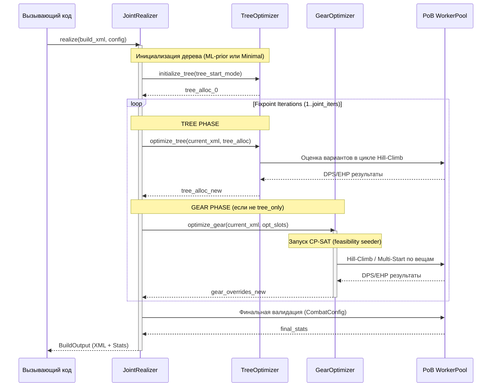

# Архитектура Joint Realizer (Phase 3) — Спецификация дизайна

Этот документ описывает архитектурный дизайн модуля `poebuildgen/realizer/` для совместной оптимизации дерева пассивных умений и снаряжения в fixpoint-цикле с использованием ML-prior (CatBoost) и CP-SAT (в качестве seeder'а).

---

## 1. Назначение и принципы проектирования

Joint Realizer является ключевым вычислительным узлом генератора билдов, реализующим парадигму **correctness-first (D37)**. Он решает совместную задачу оптимизации дерева и снаряжения, учитывая их круговые зависимости (например, attribute-stacking, конверсии, резисты и требования к характеристикам).

### Основные принципы:
1. **Разделение ответственности (Separation of Concerns):** Отдельные модули для оптимизации дерева (`tree.py`), шмота (`gear.py`) и координации fixpoint-цикла (`joint.py`).
2. **CP-SAT как seeder, а не максимизатор (D15/D22):** Линейный решатель CP-SAT используется исключительно для генерации допустимого (feasible) по ограничениям (резисты, атрибуты, бюджет) снаряжения. Финальная оптимизация DPS/EHP производится в нелинейном пространстве через оракул PoB.
3. **ML-prior как стартовая точка (3C-3):** Модель CatBoost даёт априорное распределение вероятностей по нотаблам, уберегая алгоритм Dijkstra/Hill-Climb от проседания в неоптимальные ветки дерева (проблема cold start).
4. **Устойчивость и кэширование:** Оценка тысяч вариантов дерева и шмота требует параллелизма (`WorkerPool`) и интеллектуального кэширования результатов вычисления PoB во избежание утечек памяти.
5. **Принцип max(heuristic, ML) согласно D37:** В соответствии с требованиями D37, Realizer поддерживает сравнительный запуск оптимизации для обоих стартовых семян дерева (ml-prior и minimal/heuristic-baseline) и выбирает финальный вариант, показавший максимальный DPS в оракуле PoB.

---

## 2. Общая структура модулей

Модуль `poebuildgen/realizer/` имеет следующую структуру файлов:

```
poebuildgen/realizer/
├── __init__.py           # Экспорт публичного API (класс Realizer)
├── joint.py              # Координатор fixpoint-цикла (класс JointRealizer)
├── tree.py               # Оптимизатор дерева (Dijkstra + Hill-Climb + ML-prior)
└── gear.py               # Оптимизатор снаряжения (CP-SAT seeder + PoB-in-loop)
```

---

## 3. Спецификация API и Контракты данных

### 3.1 Публичный интерфейс (`poebuildgen/realizer/__init__.py`)

```python
from typing import Optional
from poebuildgen.model import PobBuild
from poebuildgen.pool import WorkerPool

class Realizer:
    def __init__(
        self,
        pool: WorkerPool,
        model_path: Optional[str] = None,
        config_path: Optional[str] = None
    ) -> None:
        """
        Инициализирует Realizer с пулом воркеров и путями к ML-модели.
        """
        pass

    def realize(
        self,
        build: PobBuild,
        *,
        budget: float,
        gear_start: str = "stripped",  # "stripped" | "expert"
        tree_start: str = "ml",        # "ml" | "minimal" | "expert" | "both" (запуск обоих и выбор max по DPS согласно D37)
        joint_iters: int = 2,
        tree_rounds: int = 25,
        life_frac: float = 0.6,
        tree_only: bool = False
    ) -> PobBuild:
        """
        Выполняет совместную оптимизацию дерева и снаряжения.
        Возвращает оптимизированный экземпляр PobBuild.
        """
        pass
```

### 3.2 Выходной контракт: `BuildOutput` (в соответствии с DESIGN-v2 §3.1)

Класс `BuildOutput` оборачивает результат оптимизации для выдачи пользователю, добавляя метаданные доверия к вычислениям PoB:

```python
from pydantic import BaseModel
from typing import Dict, List
from poebuildgen.model import PobBuild

class BuildOutput(BaseModel):
    build: PobBuild
    pob_code: str                                # Base64URL(Deflate(XML))
    pob_stats: Dict[str, float]                  # Сырые статы PoB (DPS, EHP, Life...)
    effective_dps: float                         # PoB_DPS * damage_uptime_coefficient (D28)
    pob_trust_flags: Dict[str, str]              # "high" | "medium" | "low" для механик
    liquidity_flags: Dict[str, str]              # "liquid" | "illiquid" для предметов
    uptime_assumptions: Dict[str, float]         # Flask/Buff uptimes
    caveats: List[str]                           # Текстовые предупреждения
```

---

## 4. Алгоритм совместной оптимизации (Fixpoint Loop)

Фикс-поинт цикл координируется классом `JointRealizer` в `poebuildgen/realizer/joint.py`. 

### Схема взаимодействия (Sequence Diagram)



### Алгоритм Fixpoint (по шагам):
1. **Инициализация:** 
   * Считывается эталонный `PobBuild`.
   * Извлекается стартовый шмот (если `gear_start == "stripped"`, рарные вещи заменяются на базовые болванки без аффиксов).
   * Инициализируется стартовое дерево:
     * Если `tree_start == "ml"`, CatBoost модель ранжирует нотаблы, и Dijkstra сшивает top-K приоритетных нотаблов.
     * Если `tree_start == "minimal"`, дерево сбрасывается до стартового узла класса и нотаблов восхождения (Ascendancy).
2. **Шаг Дерева (Tree Optimization):**
   * Запускается `hillclimb_tree_build`. Алгоритм итеративно добавляет и удаляет нотаблы, оценивая их влияние на DPS в PoB (PoB-in-loop).
   * Dijkstra сшивает выбранные нотаблы кратчайшими путями.
3. **Шаг Снаряжения (Gear Optimization):**
   * На основе текущего дерева CP-SAT генерирует пул допустимых предметов, удовлетворяющих требованиям по атрибутам (Strength, Intelligence, Dexterity), сопротивлениям стихиям (Resistances) и бюджету.
   * `optimize_gear` производит локальный поиск (hill-climb) по свойствам вещей (affixes) в PoB для выбора максимального DPS/EHP вектора под управлением функции Чебышева (T-score).
4. **Проверка сходимости:**
   * Оценивается изменение статов (DPS/EHP/Life) по сравнению с предыдущей итерацией. Если дельта $\le 0.5\%$, цикл завершается досрочно.
   * Во избежание осцилляций (бесконечных циклов "дерево меняется под шмот, шмот под дерево") применяется штрафной коэффициент на перевыбор узлов дерева/модов.

---

## 5. Детализация модулей

### 5.1 Оптимизатор дерева (`poebuildgen/realizer/tree.py`)

Модуль инкапсулирует работу с графом дерева пассивных умений:
*   **`load_tree_graph(pob)`**: Загружает граф дерева пассивных умений из PoB.
*   **`predict_tree_alloc()`**: Интегрирует ML-модель. Принимает дескриптор осей билда и выдает вероятностное ранжирование нотаблов.
*   **`Dijkstra Stitching`**: Строит кратчайшие пути от стартовой точки класса до выбранных нотаблов target-set, минимизируя траты очков бюджета (по умолчанию 123).
*   **`hillclimb_tree_build()`**: Производит локальные свопы нотаблов у границы распределения allocated-множества.

### 5.2 Оптимизатор снаряжения (`poebuildgen/realizer/gear.py`)

Модуль управляет генерацией предметов:
*   **`CP-SAT Solver Integration`**: Строит модель линейного программирования для поиска комбинации шмоток. Переменные модели описывают типы баз и ранги модов (Tiers). Констрейнты гарантируют корректность (например, не более 3 префиксов и 3 суффиксов, требования к атрибутам гемов, лимит бюджета).
*   **`optimize_gear()`**: Координирует PoB-ин-луп фазу. Получив стартовые шмотки от CP-SAT, проводит локальный градиентный спуск/подъем по тирам модов, вычисляя точный DPS в PoB.

---

## 6. Уроки фазы Joint-Spike и защита от ошибок

В дизайне Realizer учтены критические ошибки Phase 2:
1. **Защита от Silent Crash в PoB (Expert 100% False Positive):**
   * При сборке XML-файла (`combined_xml`) воркеры обязаны проверять валидность возвращаемых PoB данных.
   * Если PoB возвращает точные исходные показатели DPS эталона при измененном дереве/шмоте, это трактуется как ошибка парсинга/загрузки билда в Lua-слое. Воркер возвращает ошибку (`ValueError`), а не ложные 100%.
2. **Проблема ModPool в Expert режиме:**
   * В режиме `expert` с выключенным tree-only оптимизация снаряжения приводит к замене редких уникальных или высококлассных экспертных вещей на стандартные моды из общего `ModPool`, что обрушивает DPS до уровня stripped-билдов (~8-9%).
   * *Решение в дизайне:* Введение флага `freeze_expert_gear` (или режима `tree_only`), при котором шмот фиксируется на эталонном экспертном, а оптимизируется исключительно дерево.
3. **Бюджетный лимит очков дерева:**
   * Оригинальные экспертные деревья часто используют кластерные самоцветы (cluster jewels) и выходят за стандартные 123 очка (до 134-138 pts). При оптимизации дерева без кластеров под жесткий лимит 123 очка DPS падает до ~12-17%.
   * *Решение в дизайне:* Возможность динамической настройки бюджета очков дерева (`budget`) и автоматическое масштабирование целей на основе эталона.
